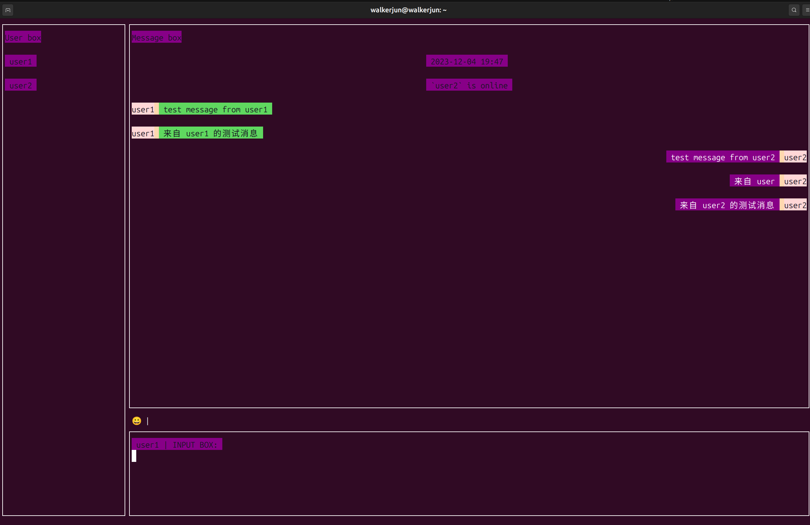

# littlechat

## About
A little chatroom run in console, write in python base on [urwid](https://github.com/urwid/urwid),
only support  Linux, OSX, Cygwin or other unix-like OS, not support Windows


## Quick Start

### Install
#### From repository
* From github
```shell
pip install git+https://github.com/yujun2647/littlechat.git
```
* From gitee
```shell
pip install git+https://gitee.com/walkerjun/littlechat.git
```
#### From Pypi
```shell
pip install littlechat
```

### Usage

#### Start server
* start server at port: 5000
```shell
lchat -t server -sp 5000
```
#### Connect with client
* connect server above
```shell
lchat -sp 5000
```

#### Chat example

